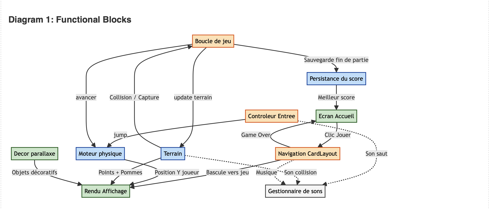
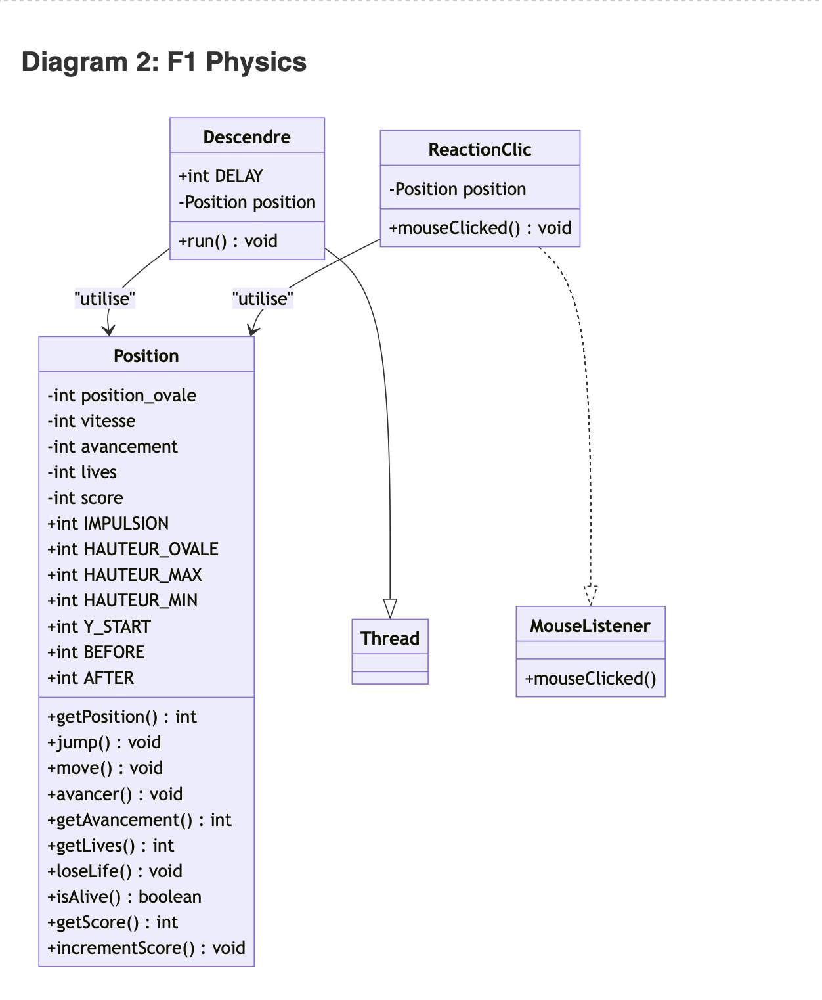
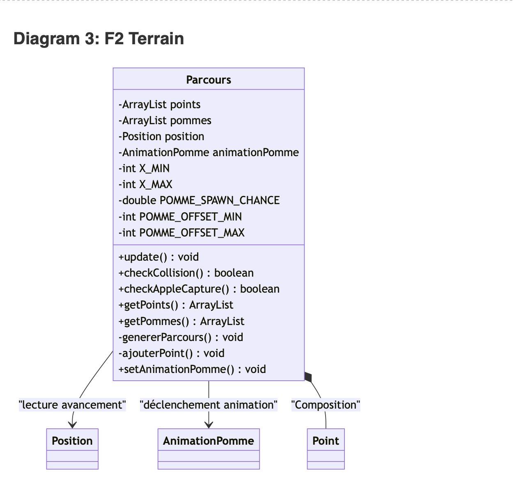
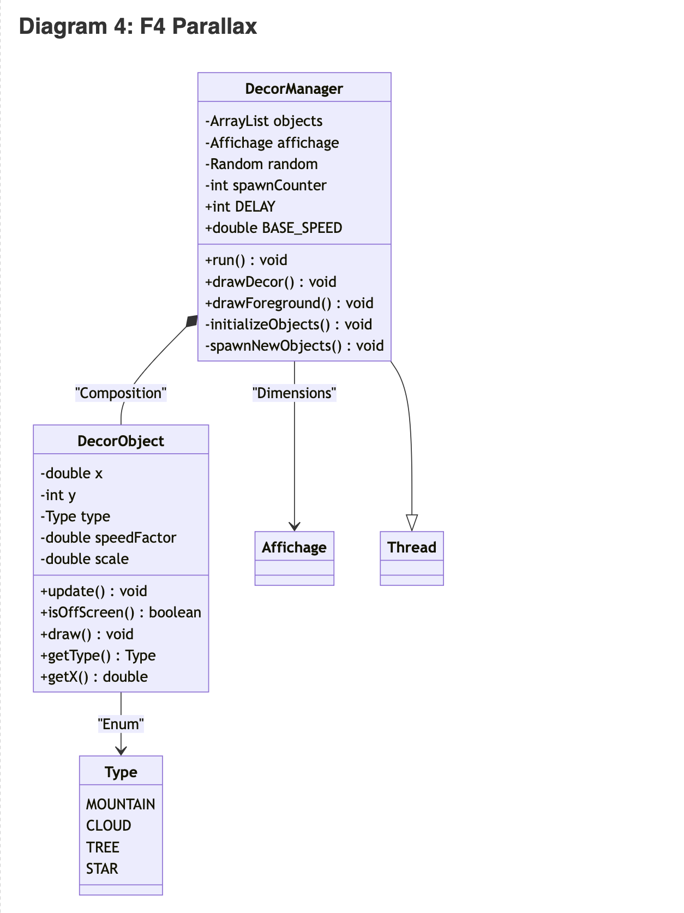
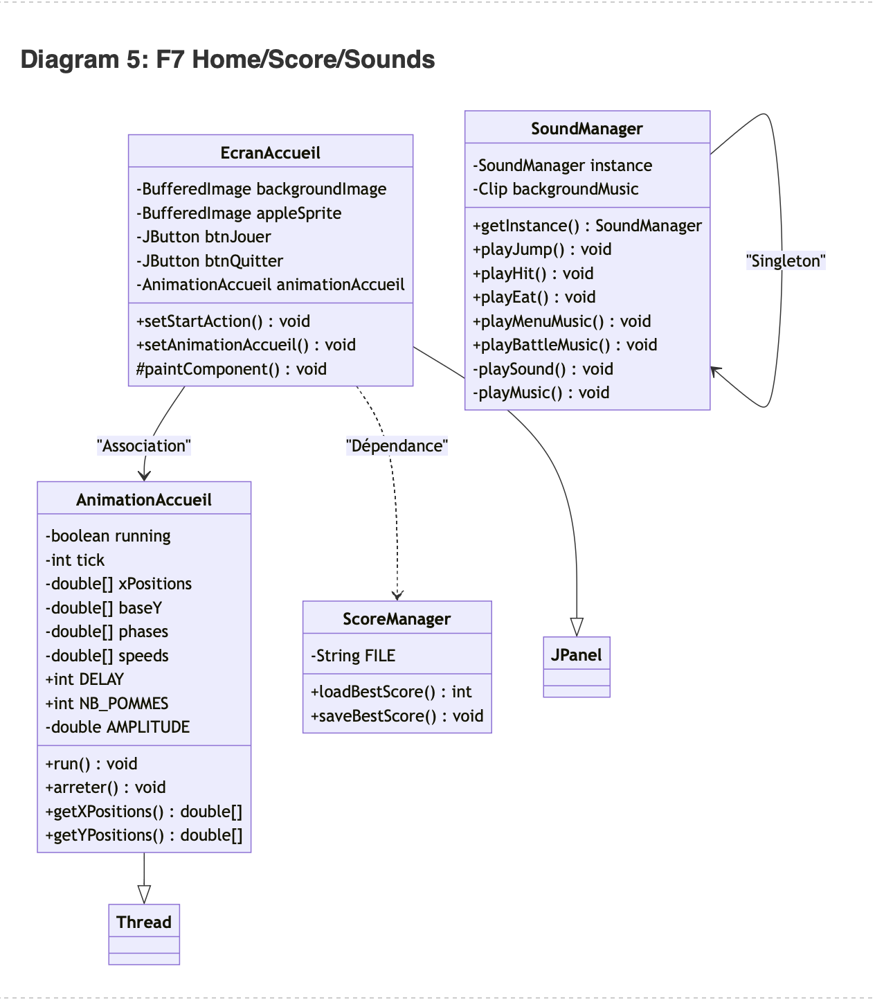
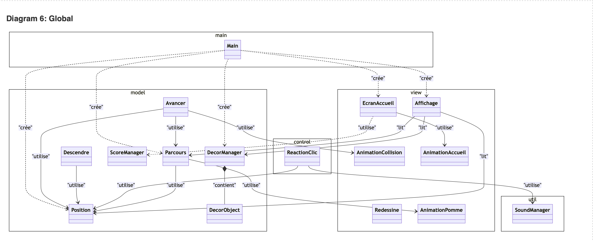
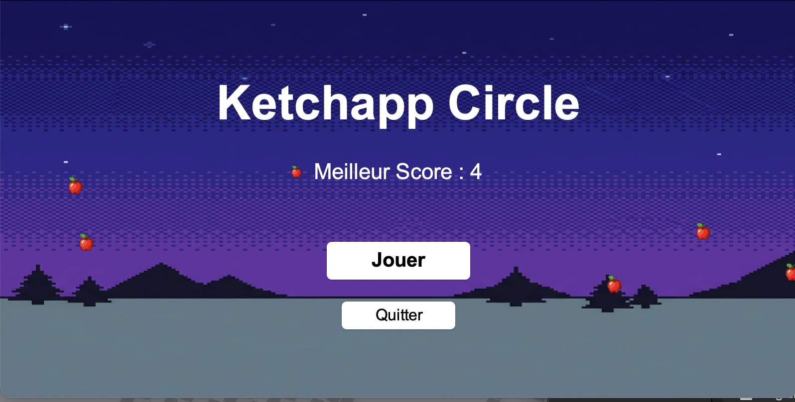
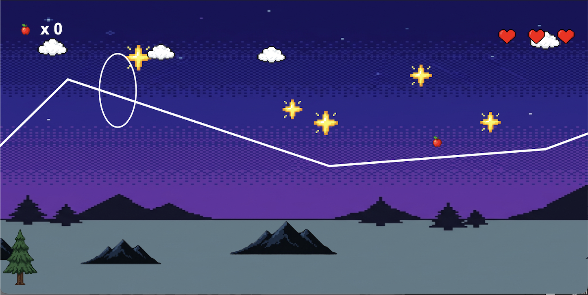
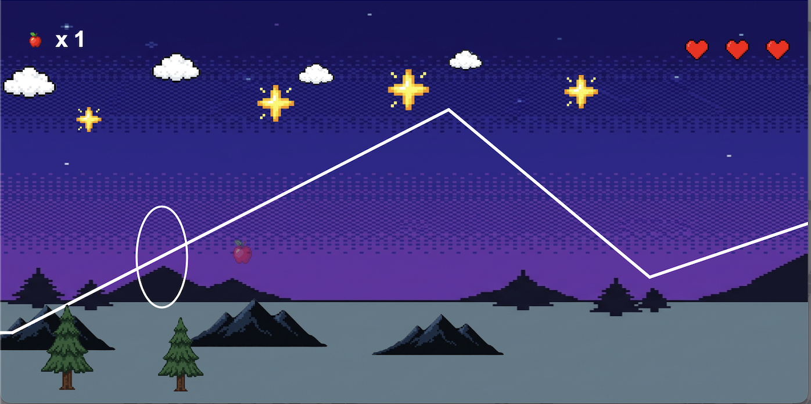
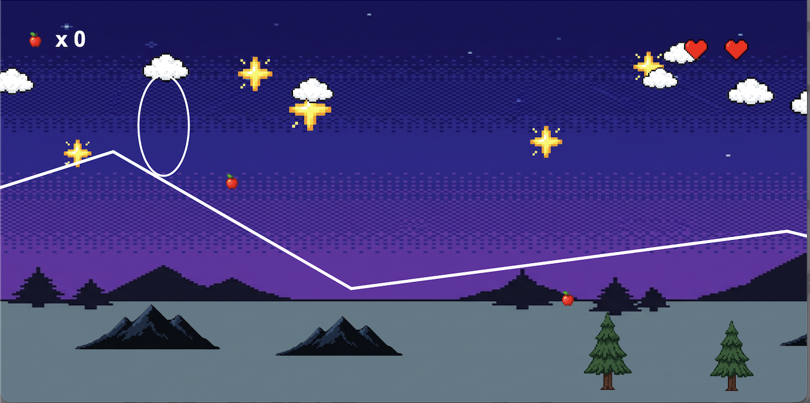

# Ketchapp Circle (Clone)
## Rapport de projet de programmation concurrentielle et interface interactive

**Université Paris-Saclay**  
**L3 Informatique**  
**2026**

---

## Table des matières
1. [Introduction](#1-introduction)
2. [Analyse globale](#2-analyse-globale)
3. [Plan de développement](#3-plan-de-développement)
4. [Conception générale](#4-conception-générale)
5. [Conception détaillée](#5-conception-détaillée)
6. [Résultats](#6-résultats)
7. [Documentation utilisateur](#7-documentation-utilisateur)
8. [Documentation développeur](#8-documentation-développeur)
9. [Conclusion et perspectives](#9-conclusion-et-perspectives)

---

## 1. Introduction

Ce projet a été réalisé dans le cadre du module de **Programmation Concurrente et Interfaces Interactives** (L3 Informatique, Université Paris-Saclay). L'objectif est de reproduire le gameplay et l'esthétique du jeu mobile **Ketchapp Circle** sous la forme d'une application interactive développée en **Java/Swing**, en intégrant de manière centrale les concepts de **programmation concurrente** (Threads).

Le joueur contrôle un ovale qui navigue au-dessus d'une ligne brisée générée de façon procédurale et infinie. Le défi consiste à sauter au bon moment pour éviter de toucher la ligne (qui fait perdre des vies), tout en collectant des pommes pour augmenter son score. Le jeu se termine lorsque les trois vies du joueur sont épuisées. Ce projet a permis de mettre en pratique la gestion de plusieurs threads concurrents (gravité, scrolling, animations, décor), leur synchronisation avec l'EDT Swing, ainsi que la conception d'une architecture MVC robuste.

---

## 2. Analyse globale

L'analyse du jeu Ketchapp Circle a fait émerger **7 fonctionnalités principales** à développer, classées par priorité et niveau de difficulté. Ces fonctionnalités ont guidé le plan de développement et la conception détaillée.

### F1 — Moteur physique et déplacement du joueur
Le joueur (un ovale) est soumis à une gravité simulée (chute constante vers le bas) et peut sauter par clic souris. Un thread dédié (`Descendre`) applique la gravité à intervalles réguliers, tandis que le contrôleur (`ReactionClic`) déclenche l'impulsion de saut.

- **Difficulté** : Moyenne
- **Priorité** : Haute

### F2 — Génération procédurale du terrain (ligne brisée infinie)
Le terrain est une ligne brisée continue, générée dynamiquement point par point à mesure que le joueur avance. Les points sont espacés aléatoirement en X et Y, avec des contraintes pour rester dans l'écran et garantir que le parcours soit jouable. Les points sortis de l'écran à gauche sont supprimés pour économiser la mémoire.

- **Difficulté** : Moyenne
- **Priorité** : Haute

### F3 — Interface et rendu graphique (Affichage, anti-aliasing)
Le rendu est assuré par un `JPanel` principal (`Affichage`) utilisant `Graphics2D` pour le dessin anti-aliasé. La fenêtre est de taille fixe (800×400 pixels). Les coordonnées du modèle sont transformées en coordonnées écran via des ratios dynamiques. Un thread `Redessine` appelle `repaint()` à 20 FPS.

- **Difficulté** : Facile
- **Priorité** : Haute

### F4 — Système de parallaxe (décor à 4 couches)
Un effet de profondeur visuelle est créé par 4 couches de décor se déplaçant à des vitesses différentes : Étoiles (0.05×), Montagnes (0.3×), Nuages (0.5×), Arbres (0.8×). Chaque objet est un sprite PNG redimensionné. Un thread dédié (`DecorManager`) gère leur déplacement, suppression et régénération.

- **Difficulté** : Moyenne
- **Priorité** : Moyenne

### F5 — Système de vies et collisions
Le joueur dispose de 3 cœurs. Une collision entre l'ovale et la ligne brisée (détectée par calcul géométrique point-segment) fait perdre une vie et déclenche une invulnérabilité temporaire de 20 frames (~1 seconde). Quand les vies tombent à zéro, la boucle de jeu s'arrête et le joueur retourne à l'écran d'accueil.

- **Difficulté** : Facile
- **Priorité** : Haute

### F6 — Système de score et collectibles (pommes)
Des pommes sont générées aléatoirement (30 % de chance par segment) le long de la ligne brisée, avec un offset vertical aléatoire. Le joueur capture une pomme en la faisant passer à l'intérieur du corps de l'ovale. Chaque capture incrémente un compteur affiché en temps réel et déclenche une animation de grossissement + fondu gérée par un thread dédié (`AnimationPomme`).

- **Difficulté** : Moyenne
- **Priorité** : Moyenne

### F7 — Écran d'accueil, meilleur score et sons
Un écran d'accueil précède le jeu, avec le titre, le meilleur score persistant (sauvegardé dans `bestscore.txt`), des boutons "Jouer" et "Quitter", et une animation de pommes flottantes (thread `AnimationAccueil`). Un `CardLayout` gère la bascule entre l'accueil et le jeu. Un `SoundManager` (Singleton) joue des effets sonores (saut, collision, capture) et des musiques de fond (menu, jeu).

- **Difficulté** : Moyenne
- **Priorité** : Haute

### Tableau récapitulatif

| # | Fonctionnalité | Difficulté | Priorité |
|---|----------------|------------|----------|
| F1 | Moteur physique et déplacement | Moyenne | Haute |
| F2 | Génération procédurale du terrain | Moyenne | Haute |
| F3 | Interface et rendu graphique | Facile | Haute |
| F4 | Système de parallaxe (4 couches) | Moyenne | Moyenne |
| F5 | Système de vies et collisions | Facile | Haute |
| F6 | Système de score et collectibles (pommes) | Moyenne | Moyenne |
| F7 | Écran d'accueil, meilleur score et sons | Moyenne | Haute |

---

## 3. Plan de développement

Le développement s'est organisé en 3 séances suivant une approche incrémentale. Chaque séance s'appuie sur les résultats de la précédente.

### Séance 1 — Squelette MVC, physique et terrain (Semaine 1)
- **Analyse** (15min) : Étude de la structure MVC Java/Swing, recherche de mécaniques de gravité et de génération procédurale.
- **Conception** (15min) : Définition des classes `Main`, `Position`, `Affichage`, `Parcours` et de leurs responsabilités. Algorithme de la ligne brisée.
- **Développement** (~3h) : Création de la fenêtre `JFrame` (15min), de la classe `Position` (15min), du thread `Descendre` (15min), de la classe `Parcours` / ligne brisée (1h) — `ajouterPoint`, `update()`, coordonnées décalées —, de la classe `Affichage` + transformations graphiques (30min), refactoring MVC (15min), anti-aliasing (10min), thread `Redessine` (10min), `synchronized` (10min).
- **Test** (15min) : Vérification que la fenêtre s'affiche, que le scrolling est fluide, que la génération infinie fonctionne sans crash.

*Sous-tâches :* Classe `Position` (attributs et getters), Classe `Affichage` (JPanel + paintComponent), Classe `Main` (JFrame + lancement), Thread `Descendre`, Thread `Avancer`, Classe `Parcours` (génération + nettoyage), Thread `Redessine`.

### Séance 2 — Interaction, gameplay et décors (Semaine 2)
- **Analyse** (15min) : Étude du `MouseListener` Swing, calibration des constantes de saut. Recherche sur l'effet parallaxe.
- **Conception** (15min) : Mécanisme de saut (impulsion + décélération). Architecture `DecorManager` + `DecorObject` (couches et vitesses).
- **Développement** (~2.5h) : `jump()` (15min), calibration constantes (15min), `DecorObject` (15min), chargement sprites PNG (15min), thread `DecorManager` (30min). Création des sprites Pixel Art (1h).
- **Test** (15min) : Playtesting, ajustement de la jouabilité. Vérification du parallaxe fluide.

*Sous-tâches :* Classe `ReactionClic` (contrôleur clic), Méthode `jump()` dans `Position`, Calibration des constantes, Classe `DecorObject` (enum Type, sprites, vitesse), Thread `DecorManager` (boucle + spawn), Intégration des sprites, `drawDecor()` / `drawForeground()` dans `Affichage`.

### Séance 3 — Collisions, score, accueil et polish (Semaine 3)
- **Analyse** (15min) : Algorithme de détection de collision point-segment, format de sauvegarde du score.
- **Conception** (15min) : Système de vies + cooldown, algorithme de capture pomme, écran d'accueil avec `CardLayout`.
- **Développement** (~4.25h) : `checkCollision` (1h), `loseLife()` + cooldown (15min), `AnimationCollision` (15min), génération pommes + `checkAppleCapture` (45min), `AnimationPomme` (15min), HUD score + cœurs (15min), `ScoreManager` (15min), `EcranAccueil` + `CardLayout` (30min), `AnimationAccueil` (15min), `SoundManager` (15min).
- **Test** (30min) : Tests de régression — collisions, capture de pommes, transitions accueil ↔ jeu, persistance du score.

*Sous-tâches :* Collision + vies + invulnérabilité, Pommes (génération, capture, animation), Écran d'accueil + CardLayout, ScoreManager (bestscore.txt), SoundManager (effets + musiques), Cœurs (HUD), Score (HUD).

### Autres tâches (transversales)
- **Rédaction du rapport** : tout au long du projet (2h).
- **Création des sprites Pixel Art** : séance 2 (1h, incluse dans le développement de la séance 2).
- **Tests de régression** : séance 3 (30min, incluse dans les tests de la séance 3).

**Total estimé : ~15h.**

### Diagramme de Gantt (fichier à part)

---

## 4. Conception générale

Le projet suit rigoureusement le patron **Modèle-Vue-Contrôleur** (MVC) pour séparer les données de leur représentation et de la logique d'interaction.

### Structure du projet

- **Modèle** (`com.example.model`) : contient la logique métier du jeu — position du joueur, terrain, objets décoratifs, gestion du score, threads de physique et de scrolling.
- **Vue** (`com.example.view`) : affiche les éléments visuels — rendu du terrain, du joueur, du décor, du HUD, des animations, et de l'écran d'accueil.
- **Contrôleur** (`com.example.control`) : gère les événements utilisateurs (clics souris) et transmet les commandes au modèle.
- **Utilitaires** (`com.example.util`) : gestion transversale des sons (Singleton `SoundManager`).

### Blocs fonctionnels et circulation de l'information

Le schéma ci-dessous présente l'architecture fonctionnelle du projet. Les rectangles représentent les blocs fonctionnels (pas encore des classes), les flèches montrent la circulation de l'information.



#### Description des blocs

1. **Écran d'accueil** : Point d'entrée visuel. Présente le titre, le meilleur score et propose de jouer. Une animation de pommes flottantes donne vie à cet écran. Communique au bloc « Navigation » l'ordre de basculer vers le jeu.

2. **Navigation (CardLayout)** : Gère la bascule entre l'écran d'accueil et le jeu. Transmet aussi la transition retour (fin de partie → accueil).

3. **Moteur physique** : Applique en continu la gravité sur le joueur (descente) et traite les impulsions de saut. Fournit en permanence la position verticale du joueur au bloc « Rendu ».

4. **Boucle de jeu (Scrolling)** : Fait avancer le monde horizontalement, met à jour le terrain, vérifie les collisions et les captures de pommes. C'est le cœur de la logique de jeu. Communique avec le terrain, le joueur et le rendu.

5. **Terrain (Génération procédurale)** : Génère et maintient la ligne brisée infinie ainsi que les pommes collectibles. Fournit les données au bloc « Rendu » et au bloc « Boucle de jeu » (pour les collisions).

6. **Contrôleur d'entrée** : Intercepte les clics souris et déclenche le saut dans le moteur physique.

7. **Décor parallaxe** : Gère les 4 couches d'objets décoratifs (étoiles, montagnes, nuages, arbres) et leur déplacement parallèle. Envoie les données de rendu au bloc « Rendu ».

8. **Rendu (Affichage)** : Dessine tous les éléments visuels à l'écran (fond, décor, terrain, joueur, pommes, HUD). Reçoit les données de tous les blocs modèle.

9. **Gestionnaire de sons** : Joue les effets sonores (saut, collision, capture) et les musiques de fond (menu, jeu). Est invoqué par les blocs qui déclenchent des événements.

10. **Persistance du score** : Lit et sauvegarde le meilleur score dans un fichier. Communique avec l'écran d'accueil (lecture) et la boucle de jeu (écriture en fin de partie).

### Threads principaux

Le projet utilise **6 threads concurrents** en plus de l'EDT Swing :

| Thread | Rôle | Période |
|--------|------|---------|
| `Descendre` | Applique la gravité (descend le joueur) | 100 ms |
| `Avancer` | Boucle de jeu : scrolling, collisions, capture pommes | 50 ms |
| `Redessine` | Rafraîchissement de l'affichage (repaint) | 50 ms |
| `DecorManager` | Déplacement et spawn des objets décoratifs | 50 ms |
| `AnimationCollision` | Animation de secousse lors d'un impact | 50 ms |
| `AnimationPomme` | Animation grossissement + fondu lors d'une capture | 40 ms |

Et un thread supplémentaire sur l'écran d'accueil :

| Thread | Rôle | Période |
|--------|------|---------|
| `AnimationAccueil` | Animation des pommes flottantes sinusoïdales | 40 ms |

---

## 5. Conception détaillée

Cette section décrit précisément chaque fonctionnalité, dans l'ordre des 7 fonctionnalités identifiées en analyse globale.

---

### 5.1 F1 — Moteur physique et déplacement du joueur

#### Structures de données

- **`Position`** : Classe centrale du modèle. Encapsule la position verticale de l'ovale (`position_ovale`), sa vitesse instantanée (`vitesse`), l'avancement horizontal global (`avancement`), le nombre de vies (`lives`) et le score (`score`).

#### Constantes du modèle

| Constante | Valeur | Description |
|-----------|--------|-------------|
| `IMPULSION` | 5 | Force du saut (pixels/frame) |
| `HAUTEUR_OVALE` | 100 | Hauteur de l'ovale joueur (unités modèle) |
| `HAUTEUR_MAX` | 400 | Borne inférieure du monde (sol) |
| `HAUTEUR_MIN` | 0 | Borne supérieure du monde (plafond) |
| `Y_START` | 20 | Position verticale initiale du joueur |
| `Descendre.DELAY` | 100 ms | Fréquence d'application de la gravité |

#### Algorithme abstrait

```
INITIALISER vitesse ← 0, position_ovale ← Y_START

[Thread Descendre — toutes les 100ms]
CALCULER sol ← HAUTEUR_MAX - HAUTEUR_OVALE
SI position_ovale < sol ALORS
    position_ovale ← position_ovale + vitesse
    vitesse ← vitesse - 1        // Décélération (gravité)
FIN SI
SI position_ovale < HAUTEUR_MIN ALORS
    position_ovale ← HAUTEUR_MIN // Ne pas sortir par le haut
FIN SI

[Contrôleur ReactionClic — au clic souris]
vitesse ← IMPULSION              // Impulsion vers le haut
```

La physique fonctionne avec un système d'impulsion et de décélération : au saut, la vitesse est mise à `IMPULSION` (positif = vers le haut). À chaque tick de gravité, la vitesse est décrémentée de 1, ce qui produit une trajectoire parabolique naturelle.

#### Conditions limites

- L'ovale ne doit jamais dépasser `HAUTEUR_MIN` (haut de l'écran).
- L'ovale ne doit jamais descendre sous le sol (`HAUTEUR_MAX - HAUTEUR_OVALE`).
- Un saut pendant un saut est possible (double saut) : c'est un choix de gameplay voulu.

#### Interactions avec les autres fonctionnalités

- **F5 (Collisions)** : `Position` expose `getPosition()` utilisé par `Parcours.checkCollision()`.
- **F3 (Affichage)** : `Affichage` lit `getPosition()` pour calculer la position Y de l'ovale à l'écran.
- **F6 (Score)** : `Position` stocke le score (pommes capturées).

#### Diagramme de classes (F1)



---

### 5.2 F2 — Génération procédurale du terrain

#### Structures de données

- **`Parcours`** : Maintient une `ArrayList<Point>` de points de la ligne brisée en coordonnées absolues, et une `ArrayList<Point>` de pommes. Contient un `Random` pour la génération aléatoire.

#### Constantes du modèle

| Constante | Valeur | Description |
|-----------|--------|-------------|
| `X_MIN` | 50 | Écart horizontal minimum entre deux points |
| `X_MAX` | 150 | Écart horizontal maximum entre deux points |
| `BEFORE` | 50 | Marge à gauche de l'ovale (Position) |
| `AFTER` | 200 | Marge à droite de l'ovale (Position) |

#### Algorithme abstrait

```
INITIALISATION:
    currentX ← -BEFORE
    currentY ← Y_START + HAUTEUR_OVALE / 2  // Milieu de l'ovale
    AJOUTER (currentX, currentY) à la liste
    Générer des points jusqu'à currentX > AFTER + 200

AJOUT D'UN POINT (ajouterPoint):
    lastPoint ← dernier point de la liste
    nextX ← lastPoint.x + X_MIN + RANDOM(0, X_MAX - X_MIN)
    safeMin ← HAUTEUR_MIN + 100
    safeMax ← HAUTEUR_MAX - HAUTEUR_OVALE
    nextY ← safeMin + RANDOM(0, safeMax - safeMin)
    AJOUTER (nextX, nextY)
    [Génération optionnelle de pomme — voir F6]

MISE À JOUR (update — appelé par Avancer):
    SI points[1].x - avancement < -BEFORE ALORS
        SUPPRIMER points[0]
    FIN SI
    SUPPRIMER les pommes hors écran
    SI dernier point proche de l'horizon ALORS
        ajouterPoint()
    FIN SI

LECTURE (getPoints):
    RETOURNER une copie décalée de -avancement pour chaque point
```

#### Conditions limites

- Les points Y doivent rester dans l'intervalle `[HAUTEUR_MIN + 100, HAUTEUR_MAX - HAUTEUR_OVALE]` pour que le terrain soit jouable.
- Le premier segment est horizontal (même Y) pour laisser le temps au joueur de réagir.
- La suppression de points ne doit se faire que quand le segment est entièrement sorti de l'écran.

#### Interactions avec les autres fonctionnalités

- **F1 (Position)** : Lit `position.getAvancement()` pour décaler les coordonnées.
- **F5 (Collisions)** : Expose `checkCollision()` appelé par `Avancer`.
- **F6 (Pommes)** : Génère les pommes lors de `ajouterPoint()`, expose `checkAppleCapture()`.
- **F3 (Affichage)** : Expose `getPoints()` et `getPommes()` pour le rendu.

#### Diagramme de classes (F2)



---

### 5.3 F3 — Interface et rendu graphique

#### Structures de données

- **`Affichage`** : `JPanel` principal. Contient les références au modèle (`Position`, `Parcours`, `DecorManager`), les sprites chargés (`BufferedImage`), et les variables d'état d'animation.
- **`Redessine`** : Thread qui appelle `repaint()` à intervalle régulier.

#### Constantes du modèle

| Constante | Valeur | Description |
|-----------|--------|-------------|
| `LARGEUR_INIT` | 800 | Largeur de la fenêtre (pixels) |
| `HAUTEUR_INIT` | 400 | Hauteur de la fenêtre (pixels) |
| `LARG_OVAL` | 50 | Largeur de l'ovale à l'écran (pixels) |
| `STROKE_TERRAIN` | 3.0 | Épaisseur de la ligne du terrain |
| `Redessine.DELAY` | 50 ms | Période de rafraîchissement (≈20 FPS) |

#### Algorithme abstrait

```
TRANSFORMATION MODÈLE → ÉCRAN:
    ratioX ← largeurFenêtre / (BEFORE + AFTER)
    ratioY ← hauteurFenêtre / (HAUTEUR_MAX - HAUTEUR_MIN)
    transformX(xModel) = (xModel + BEFORE) × ratioX
    transformY(yModel) = (HAUTEUR_MAX - yModel) × ratioY  // Y inversé

RENDU (paintComponent — appelé par EDT Swing):
    1. Dessiner le fond (sprite ou dégradé fallback)
    2. Dessiner le décor arrière-plan (étoiles, montagnes, nuages)
    3. Dessiner la ligne brisée (segments blancs anti-aliasés)
    4. Dessiner les pommes (sprites)
    5. Dessiner l'ovale joueur (contour blanc, avec effet secousse si animation)
    6. Dessiner le décor premier plan (arbres)
    7. Dessiner le HUD : cœurs (haut droite) + score pommes (haut gauche)
```

#### Sous-fonctionnalités

- **Chargement des sprites** : Les images (`background_sky.png`, `heart.png`, `apple.png`) sont chargées au constructeur via `ImageIO.read()` depuis les ressources. Un fallback dégradé est prévu si le chargement échoue.
- **Anti-aliasing** : Activé via `RenderingHints.KEY_ANTIALIASING` pour un rendu lisse.
- **Transformation de coordonnées** : Le modèle utilise un système de coordonnées où Y=0 est en haut et Y=400 est en bas. La vue inverse l'axe Y pour que les objets « en haut » du modèle soient dessinés en haut de l'écran.

#### Conditions limites

- Si un sprite n'est pas trouvé, le jeu ne doit pas crash (fallback gracieux).
- Le `paintComponent` ne doit pas modifier le modèle (respect MVC).
- Le thread `Redessine` est séparé pour ne pas bloquer l'EDT.

#### Interactions avec les autres fonctionnalités

- Lit les données de **F1** (`Position`), **F2** (`Parcours`), **F4** (`DecorManager`).
- Affiche les animations de **F5** et **F6** (frames transmises par setters).

---

### 5.4 F4 — Système de parallaxe (4 couches de décor)

#### Structures de données

- **`DecorObject`** : Représente un objet décoratif individuel (position, type, vitesse, échelle). Contient un enum `Type` : `MOUNTAIN`, `CLOUD`, `TREE`, `STAR`.
- **`DecorManager`** (extends `Thread`) : Maintient une `ArrayList<DecorObject>` synchronisée, gère le déplacement, la suppression et la régénération des objets.

#### Constantes du modèle

| Constante | Valeur | Description |
|-----------|--------|-------------|
| `BASE_SPEED` | 2.0 | Vitesse de base de déplacement |
| `DELAY` | 50 ms | Période de mise à jour |
| Vitesse STAR | 0.05× | Facteur de vitesse des étoiles |
| Vitesse MOUNTAIN | 0.3× | Facteur de vitesse des montagnes |
| Vitesse CLOUD | 0.5× | Facteur de vitesse des nuages |
| Vitesse TREE | 0.8× | Facteur de vitesse des arbres |

#### Algorithme abstrait

```
INITIALISATION:
    Créer 3 montagnes, 5 étoiles, 4 nuages, 3 arbres répartis sur l'écran

BOUCLE (toutes les 50ms):
    POUR CHAQUE objet DANS objects (synchronized):
        objet.x ← objet.x - BASE_SPEED × objet.speedFactor
        SI objet.x < -200 ALORS SUPPRIMER objet
    FIN POUR

    spawnCounter++
    SI spawnCounter ≥ 20 ALORS
        chance ← RANDOM(0, 100)
        SI chance < 20 ALORS spawn MOUNTAIN
        SINON SI chance < 50 ALORS spawn CLOUD
        SINON SI chance < 70 ALORS spawn TREE
        SINON SI chance < 80 ALORS spawn STAR
        spawnCounter ← 0
    FIN SI

DESSIN (drawDecor — appelé par Affichage):
    Dessiner dans l'ordre : STAR → MOUNTAIN → CLOUD
    (Les TREE sont dessinés séparément via drawForeground, après le terrain)
```

#### Conditions limites

- La liste `objects` est accédée par le thread `DecorManager` (modification) et par l'EDT Swing via `paintComponent` (lecture). La synchronisation est assurée par un bloc `synchronized(objects)`.
- Les objets sont supprimés à x < -200 pour être sûrs qu'ils sont complètement hors écran.
- L'échelle de chaque objet est randomisée pour créer de la variation visuelle.

#### Diagramme de classes (F4)



---

### 5.5 F5 — Système de vies et collisions

#### Structures de données

- **`Position`** : Contient `lives` (int, initialisé à 3), et les méthodes `loseLife()`, `isAlive()`, `getLives()`.
- **`AnimationCollision`** (extends `Thread`) : Gère l'effet de secousse de l'ovale lors d'un impact.

#### Constantes du modèle

| Constante | Valeur | Description |
|-----------|--------|-------------|
| Nombre de vies initial | 3 | Cœurs du joueur |
| `TOLERANCE` | 5 px | Marge de détection de collision |
| Cooldown collision | 20 frames | Invulnérabilité après un coup (~1s) |
| `AnimationCollision.NOMBRE_FRAMES` | 6 | Durée de l'animation de secousse |
| `AnimationCollision.COOLDOWN` | 1000 ms | Cooldown entre animations |

#### Algorithme abstrait — Détection de collision

```
checkCollision(ovalY, ovalHeight):
    ovalX ← 0
    ovalTop ← ovalY + ovalHeight

    POUR CHAQUE segment (p1, p2) de la ligne brisée:
        SI p1.x ≤ ovalX ≤ p2.x ALORS
            pente ← (p2.y - p1.y) / (p2.x - p1.x)
            yLigne ← p1.y + (ovalX - p1.x) × pente

            SI |yLigne - ovalY| ≤ TOLERANCE
            OU |yLigne - ovalTop| ≤ TOLERANCE
            ALORS
                RETOURNER vrai (collision)
            FIN SI
        FIN SI
    FIN POUR
    RETOURNER faux
```

#### Algorithme abstrait — Boucle de jeu (Avancer.run)

```
cooldown ← 0

TANT QUE joueur est vivant:
    SI cooldown > 0 ALORS cooldown--

    position.avancer()
    parcours.update()

    SI cooldown == 0 ET checkCollision() ALORS
        AnimationCollision.demarrerAnimation()
        position.loseLife()
        cooldown ← 20
    FIN SI

    SI checkAppleCapture() ALORS
        position.incrementScore()
    FIN SI

    ATTENDRE DELAY ms

// Fin de partie
ScoreManager.saveBestScore(score)
Retour à l'écran d'accueil (via SwingUtilities.invokeLater)
```

#### Algorithme abstrait — Animation de secousse

```
Thread AnimationCollision — tourne en permanence:
    SI enAnimation ALORS
        affichage.setAnimationFrame(frameActuelle)
        frameActuelle++
        SI frameActuelle > NOMBRE_FRAMES ALORS
            enAnimation ← faux
            affichage.setAnimationFrame(-1)
        FIN SI
    ATTENDRE 50ms

demarrerAnimation():
    SI pas en animation ET cooldown expiré ALORS
        enAnimation ← vrai, frameActuelle ← 0
```

L'animation de secousse fonctionne ainsi : quand `frameAnimation ≥ 0` dans `Affichage`, la position X de l'ovale est décalée de ±2 pixels alternativement (pair/impair), créant un tremblement visuel.

#### Conditions limites

- La collision n'est détectée que sur le **bord** de l'ovale (TOLERANCE = 5px), pas à l'intérieur. Cela permet de « passer à travers » la ligne si elle est bien englobée.
- L'invulnérabilité de 20 frames empêche de perdre plusieurs vies en une seule collision.
- Le `gameOverAction` est exécuté sur l'EDT via `SwingUtilities.invokeLater` pour respecter la thread-safety Swing.

---

### 5.6 F6 — Système de score et collectibles (pommes)

#### Structures de données

- **`Parcours.pommes`** : `ArrayList<Point>` en coordonnées absolues.
- **`AnimationPomme`** (extends `Thread`) : Gère l'animation de capture (grossissement + fondu).
- **`Position.score`** : Compteur de pommes capturées.

#### Constantes du modèle

| Constante | Valeur | Description |
|-----------|--------|-------------|
| `POMME_SPAWN_CHANCE` | 0.30 | Probabilité de pomme par segment (30%) |
| `POMME_OFFSET_MIN` | 20 | Offset vertical minimum par rapport à la ligne |
| `POMME_OFFSET_MAX` | 40 | Offset vertical maximum par rapport à la ligne |
| `AnimationPomme.NOMBRE_FRAMES` | 8 | Nombre de frames de l'animation de capture |
| `AnimationPomme.DELAY_ANIMATION` | 40 ms | Durée d'une frame (total ≈ 320ms) |
| Marge de capture | 15 px | La pomme doit être bien à l'intérieur de l'ovale |

#### Algorithme abstrait — Placement des pommes

```
SI RANDOM() < POMME_SPAWN_CHANCE ALORS
    prevPoint ← avant-dernier point
    nextPoint ← dernier point ajouté
    appleX ← (prevPoint.x + nextPoint.x) / 2

    t ← (appleX - prevPoint.x) / (nextPoint.x - prevPoint.x)
    lineY ← prevPoint.y + t × (nextPoint.y - prevPoint.y)

    offsetMag ← POMME_OFFSET_MIN + RANDOM(0, POMME_OFFSET_MAX - POMME_OFFSET_MIN)
    offset ← ±offsetMag (aléatoire)
    appleY ← CLAMP(lineY + offset, HAUTEUR_MIN + 10, HAUTEUR_MAX - 10)

    AJOUTER (appleX, appleY) à la liste de pommes
FIN SI
```

#### Algorithme abstrait — Capture

```
checkAppleCapture(ovalY, ovalHeight):
    POUR CHAQUE pomme:
        shiftedX ← pomme.x - avancement

        SI |shiftedX| ≤ 25 ALORS
            SI pomme.y ≥ ovalY + margin ET pomme.y ≤ ovalY + ovalHeight - margin ALORS
                SUPPRIMER pomme
                DÉCLENCHER AnimationPomme(shiftedX, pomme.y)
                RETOURNER vrai
            FIN SI
        FIN SI
    FIN POUR
    RETOURNER faux
```

#### Algorithme abstrait — Animation de capture

L'animation fonctionne comme `AnimationCollision` (même pattern thread) :
- L'image de la pomme grossit de 1× à 2× (`scale = 1 + progress`)
- L'opacité diminue de 1.0 à 0.0 (`alpha = 1 - progress`)
- Rendu via `AlphaComposite` dans `Affichage.drawPommes()`

#### Conditions limites

- La capture exige que la pomme soit **à l'intérieur** de l'ovale (marge de 15 px). Cela évite de capturer une pomme en la frôlant, ce qui serait incohérent avec la mécanique de collision (on perd une vie si on touche le bord).
- Les pommes sont supprimées de la liste lors de la capture ou quand elles sortent à gauche de l'écran.
- L'animation ne bloque pas le jeu (thread séparé).

---

### 5.7 F7 — Écran d'accueil, meilleur score et sons

Cette fonctionnalité se décompose en 3 sous-fonctionnalités.

#### 5.7.1 Écran d'accueil et navigation

**Structures de données :**
- **`EcranAccueil`** (extends `JPanel`) : Panneau d'accueil avec titre, score, boutons, animation.
- **`Main`** : Point d'entrée. Crée le `JFrame`, le `CardLayout`, l'écran d'accueil, et initialise le jeu au clic « Jouer ».
- **`AnimationAccueil`** (extends `Thread`) : 5 pommes flottantes avec mouvement sinusoïdal.

**Algorithme — Flux de navigation :**

```
LANCEMENT:
    Créer JFrame + CardLayout + container
    Créer EcranAccueil, l'ajouter au container sous "accueil"
    Démarrer AnimationAccueil (pommes flottantes)
    Démarrer musique du menu

CLIC "Jouer":
    Créer Position, Parcours, Affichage
    Ajouter Affichage au container sous "jeu"
    Créer et démarrer tous les threads (DecorManager, Redessine, Descendre,
        AnimationCollision, AnimationPomme, Avancer)
    Créer ReactionClic (contrôleur)
    Basculer musique menu → musique jeu
    Basculer CardLayout vers "jeu"

FIN DE PARTIE (vies == 0) — retour accueil :
    ScoreManager.saveBestScore(score)
    Retirer le panneau jeu du container
    Basculer CardLayout vers "accueil"
    Basculer musique jeu → musique menu
```

**Animation d'accueil :**
- 5 pommes avec positions X initiales aléatoires et Y de base variés.
- Défilement horizontal de droite à gauche (vitesse 0.5 à 1.5 px/tick).
- Oscillation verticale sinusoïdale : `y = baseY + sin(phase + tick × 0.05) × 20`.
- Quand une pomme sort à gauche, elle réapparaît à droite.

#### 5.7.2 Persistance du meilleur score

**Structures de données :**
- **`ScoreManager`** : Classe utilitaire avec méthodes statiques.

**Algorithme :**

```
loadBestScore():
    ESSAYER lire la première ligne de "bestscore.txt"
    RETOURNER l'entier lu, ou 0 si erreur

saveBestScore(score):
    best ← loadBestScore()
    SI score > best ALORS
        ÉCRIRE score dans "bestscore.txt"
    FIN SI
```

#### 5.7.3 Gestion des sons

**Structures de données :**
- **`SoundManager`** : Singleton (`getInstance()`). Gère les effets sonores courts et les musiques de fond (boucle).

**Effets sonores :**

| Son | Fichier | Déclencheur |
|-----|---------|-------------|
| Saut | `jump.wav` | `ReactionClic.mouseClicked()` |
| Impact | `hit.wav` | `Parcours.checkCollision()` |
| Capture pomme | `apple-crunch.wav` | `Parcours.checkAppleCapture()` |
| Musique menu | `Menu Theme.wav` | Lancement + retour accueil |
| Musique jeu | `Through Mountains.wav` | Clic « Jouer » |

**Algorithme — Lecture d'un son court :**

```
playSound(resourcePath):
    DANS UN NOUVEAU THREAD:
        url ← getResource(resourcePath)
        SI url == null ALORS RETOURNER
        audioIn ← AudioSystem.getAudioInputStream(url)
        clip ← AudioSystem.getClip()
        clip.open(audioIn)
        clip.start()
        // Fermeture automatique via LineListener à la fin
```

Les musiques de fond utilisent le même mécanisme mais avec `clip.loop(LOOP_CONTINUOUSLY)`.

#### Diagramme de classes (F7)



---

### Diagramme de classes global



---

## 6. Résultats

Le projet aboutit à un jeu fluide et visuellement riche, répondant aux objectifs fixés.

### Écran d'accueil



L'écran d'accueil présente le titre « Ketchapp Circle », le meilleur score persistant, et une animation de pommes flottantes gérée par un thread dédié. Les boutons « Jouer » et « Quitter » permettent de naviguer.

### Jeu en cours — Vue d'ensemble



Le jeu en cours montre tous les éléments visuels fonctionnant simultanément : la ligne brisée blanche générée de façon procédurale, l'ovale contrôlé par le joueur, les pommes collectibles, le décor parallaxe (étoiles, montagnes, nuages, arbres sur le fond pixel art) et le HUD (cœurs en haut à droite, score en haut à gauche).

### Capture d'une pomme



Lorsque l'ovale englobe une pomme, une animation de grossissement + fondu est déclenchée pendant ~320ms, et le compteur de score s'incrémente.

### Collision avec la ligne



Quand l'ovale touche la ligne par le bord (haut ou bas), un effet de secousse est déclenché et un cœur disparaît. L'invulnérabilité temporaire empêche de perdre plusieurs vies d'un coup. *Note : l'animation de secousse (±2px par frame) dure ~300ms et est difficile à capturer en screenshot statique ; elle est cependant bien visible en jeu.*

L'effet de parallaxe (4 couches de décor à des vitesses différentes) est clairement visible sur la capture du jeu en cours ci-dessus : les étoiles quasi-statiques en arrière-plan, les montagnes lentes, les nuages à vitesse moyenne, et les arbres rapides au premier plan créent un effet de profondeur convaincant.

---

## 7. Documentation utilisateur

### Installation et prérequis

1. **Java JDK 13+** : Vérifier avec `java --version`.
2. **Apache Maven** : Vérifier avec `mvn --version`.

### Compilation et lancement

Dans le dossier `demo/` du projet, exécuter :

```bash
mvn compile exec:java -Dexec.mainClass="com.example.main.Main"
```

Ou bien :

```bash
mvn compile
java -cp target/classes com.example.main.Main
```

### Comment jouer

1. **Écran d'accueil** : L'application s'ouvre sur un écran de bienvenue affichant le titre, votre meilleur score et une animation de pommes flottantes.
   - Cliquez **« Jouer »** pour lancer une partie.
   - Cliquez **« Quitter »** pour fermer l'application.

2. **En jeu** :
   - **Objectif** : Survivre le plus longtemps possible en évitant de toucher la ligne blanche, tout en collectant un maximum de pommes.
   - **Contrôle** : **Clic gauche** n'importe où dans la fenêtre pour **sauter**. L'ovale monte puis retombe naturellement (gravité).
   - **Vies** : Vous disposez de **3 cœurs** (affichés en haut à droite). Chaque contact entre le bord de l'ovale et la ligne fait perdre un cœur. À 0 cœurs, la partie s'arrête.
   - **Pommes** : Des pommes apparaissent le long de la ligne. Pour les capturer, faites en sorte que la pomme se trouve **à l'intérieur** du corps de l'ovale (entre le haut et le bas). Le score est affiché en haut à gauche.
   - **Fin de partie** : Quand les vies tombent à zéro, le meilleur score est sauvegardé automatiquement et vous revenez à l'écran d'accueil.

---

## 8. Documentation développeur

Cette section s'adresse à toute personne souhaitant reprendre, améliorer ou prolonger le projet.

### 8.1 Point d'entrée et classes à explorer en premier

| Classe | Paquet | Rôle |
|--------|--------|------|
| **`Main`** | `com.example.main` | Point d'entrée (`main()`). Gère le `CardLayout`, la création de tous les objets et threads, la transition accueil → jeu. **C'est la première classe à lire.** |
| **`Avancer`** | `com.example.model` | Boucle de jeu principale. Gère le scrolling, les collisions, la capture de pommes et la fin de partie. |
| **`Affichage`** | `com.example.view` | Vue principale. `paintComponent` dessine tous les éléments. |
| **`Position`** | `com.example.model` | Modèle central du joueur (position, physique, vies, score). |
| **`Parcours`** | `com.example.model` | Modèle du terrain (génération procédurale, pommes, collisions). |

### 8.2 Arborescence du projet

```
projet-pcii/
├── README.md                          ← Ce rapport (source Markdown)
├── doc/
│   ├── README.pdf                     ← Rapport exporté en PDF
│   ├── Rapport_Copilot.md             ← Rapport d'utilisation de Copilot
│   ├── Rapport_Copilot.pdf            ← Rapport Copilot exporté en PDF
│   ├── Gantt_Ketchapp_Circle.xlsx     ← Diagramme de Gantt (Excel)
│   └── images/                        ← Screenshots et diagrammes UML
├── demo/
│   ├── pom.xml                        ← Configuration Maven (dépendances, build)
│   ├── bestscore.txt                  ← Meilleur score persistant
│   └── src/
│       ├── main/
│       │   ├── java/com/example/
│       │   │   ├── main/              ← Point d'entrée (Main.java, Test.java)
│       │   │   ├── model/             ← Modèle (Position, Parcours, Avancer, Descendre,
│       │   │   │                         DecorManager, DecorObject, ScoreManager)
│       │   │   ├── view/              ← Vue (Affichage, EcranAccueil, Redessine,
│       │   │   │                         AnimationCollision, AnimationPomme, AnimationAccueil)
│       │   │   ├── control/           ← Contrôleur (ReactionClic)
│       │   │   └── util/              ← Utilitaires (SoundManager)
│       │   └── resources/
│       │       ├── sprites/           ← Images PNG (fond, pomme, cœur, décors)
│       │       └── sounds/            ← Fichiers WAV (effets sonores, musiques)
│       └── test/java/                 ← Tests (vide pour l'instant)
└── target/                            ← Fichiers compilés (généré par Maven)
```

### 8.3 Organisation des paquets

```
com.example.main/       → Point d'entrée (Main, Test)
com.example.model/      → Modèle : Position, Parcours, Avancer, Descendre,
                          DecorManager, DecorObject, ScoreManager
com.example.view/       → Vue : Affichage, EcranAccueil, Redessine,
                          AnimationCollision, AnimationPomme, AnimationAccueil
com.example.control/    → Contrôleur : ReactionClic
com.example.util/       → Utilitaires : SoundManager
```

### 8.4 Constantes principales à modifier

| Constante | Classe | Effet |
|-----------|--------|-------|
| `IMPULSION` | `Position` | Hauteur du saut (augmenter = saut plus haut) |
| `Avancer.DELAY` | `Avancer` | Vitesse du jeu (diminuer = plus rapide) |
| `Descendre.DELAY` | `Descendre` | Vitesse de la gravité |
| `Redessine.DELAY` | `Redessine` | FPS (diminuer = plus fluide) |
| `DecorManager.BASE_SPEED` | `DecorManager` | Vitesse du décor |
| `POMME_SPAWN_CHANCE` | `Parcours` | Fréquence des pommes (0.0 à 1.0) |
| `POMME_OFFSET_MIN/MAX` | `Parcours` | Écart vertical pomme/ligne |
| `LARGEUR_INIT / HAUTEUR_INIT` | `Affichage` | Taille de la fenêtre |

### 8.5 Fonctionnalités à développer en priorité

1. **Écran Game Over** : Actuellement, le retour à l'accueil est automatique. Il serait pertinent d'ajouter un écran intermédiaire « Game Over » affichant le score final et un bouton « Rejouer ».
   - *Suggestion :* Créer un `EcranGameOver extends JPanel`, l'ajouter au `CardLayout` dans `Main`, et basculer vers ce panneau dans `Avancer.run()` au lieu de revenir directement à l'accueil.

2. **Difficulté progressive** : La vitesse et la fréquence des pommes sont actuellement constantes. On pourrait augmenter progressivement la vitesse et les écarts du terrain en fonction du score ou du temps écoulé.
   - *Suggestion :* Ajouter un facteur `difficulte` dans `Position` incrémenté régulièrement, et l'utiliser pour moduler le delay et le spawn dans `Avancer.run()`.

3. **Niveaux ou thèmes visuels** : Changer les sprites (fond, décor) après un certain score pour varier l'expérience visuelle.
   - *Suggestion :* Créer un système de « thèmes » dans `Affichage` qui remplace les images à des seuils de score.

4. **Animations de transition** : Ajouter un fondu lors de la bascule accueil → jeu et jeu → accueil.
   - *Suggestion :* Utiliser un `Timer` Swing modifiant l'opacité d'un overlay avant de basculer le `CardLayout`.

---

## 9. Conclusion et perspectives

### Réalisations

Ce projet a abouti à une reproduction fonctionnelle et visuellement riche du jeu Ketchapp Circle. Toutes les fonctionnalités cibles ont été implémentées : physique réaliste (saut parabolique + gravité), terrain infini procédural, système de vies et collisions, collectibles animés, écran d'accueil avec meilleur score persistant, décor parallaxe à 4 couches, et ambiance sonore complète.

### Difficultés rencontrées et solutions

La principale difficulté a été la **synchronisation entre les threads et l'EDT Swing**. Plusieurs threads (`Avancer`, `Descendre`, `DecorManager`) modifient le modèle en permanence, tandis que `paintComponent` lit ces données sur l'EDT. Ce problème a été résolu par :
- L'utilisation de `repaint()` (qui poste un message sur l'EDT) plutôt que d'appeler `paint()` directement.
- La synchronisation explicite de la liste `objects` dans `DecorManager` avec des blocs `synchronized`.
- La création de **copies défensives** des listes de points dans `Parcours.getPoints()` et `getPommes()` pour éviter les `ConcurrentModificationException`.

Une autre difficulté a été le **calibrage de la physique** (constantes de saut, gravité, vitesse de scrolling) pour obtenir un gameplay fluide et agréable. Cela a nécessité de nombreuses itérations de playtesting.

### Apprentissages

- Maîtrise de la programmation concurrente en Java (Threads, synchronisation, accès concurrent).
- Respect de l'architecture MVC dans un contexte temps réel.
- Utilisation avancée de `Graphics2D` (anti-aliasing, `AlphaComposite`, transformations).
- Génération procédurale de contenu (terrain infini).
- Patterns de conception : Singleton (`SoundManager`), Callback (`Runnable` pour `gameOverAction`), `CardLayout`.

### Perspectives

L'architecture MVC choisie est robuste et extensible. Les évolutions naturelles seraient :
- **Écran Game Over** avec affichage du score et bouton Rejouer.
- **Difficulté progressive** (accélération au fil du temps).
- **Nouveaux collectibles** (bonus de vie, ralentissement temporaire, invincibilité).
- **Classement en ligne** pour comparer les scores entre joueurs.
- **Portage mobile** via JavaFX ou un framework multiplateforme.