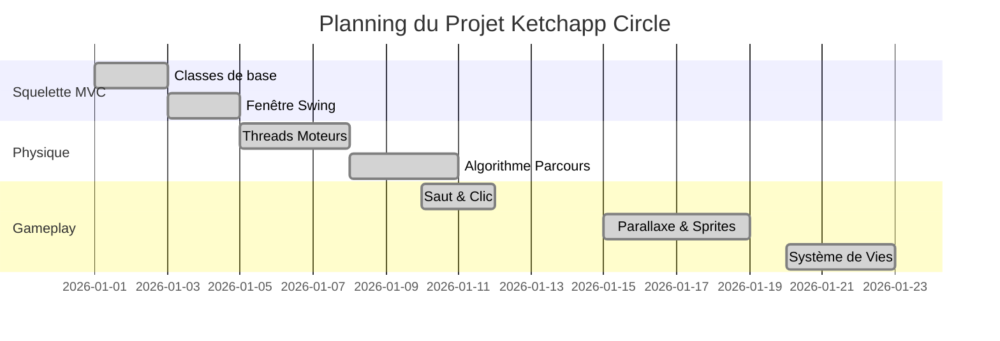

# Ketchapp Circle (Clone)
## Rapport de projet de programmation concurrentielle et interface interactive

**Université Paris-Saclay**
**L3 Informatique**
**2026**

---

## Table des matières
1. [Introduction](#1-introduction)
2. [Analyse globale](#2-analyse-globale)
3. [Plan de développement](#3-plan-de-développement)
4. [Conception générale](#4-conception-générale)
5. [Conception détaillée](#5-conception-détaillée)
6. [Résultats](#6-résultats)
7. [Documentation utilisateur](#7-documentation-utilisateur)
8. [Documentation développeur](#8-documentation-développeur)
9. [Conclusion et perspectives](#9-conclusion-et-perspectives)

---

## 1. Introduction

### Objectif du projet
Ce projet vise à reproduire le gameplay et l'esthétique du jeu mobile populaire **Ketchapp Circle**. L'objectif est de développer une application interactive en **Java/Swing** intégrant des concepts de **programmation concurrente** (Threads) pour gérer l'animation fluide, la physique et les interactions en temps réel.

Le joueur contrôle un ovale qui doit naviguer sur une ligne brisée infinie sans toucher le sol. Le défi consiste à sauter au bon moment pour éviter les obstacles et ne pas tomber.

---

## 2. Analyse globale

### Principales fonctionnalités

Le développement s'est articulé autour de plusieurs axes prioritaires, classés par difficulté et priorité :

#### 2.1 Moteur Physique et Déplacement (Priorité : Haute / Difficulté : Moyenne)
- Gravité simulée (chute constante).
- Mécanique de saut (impulsion).
- Scrolling horizontal infini du terrain.

#### 2.2 Génération Procédurale du Terrain (Priorité : Haute / Difficulté : Moyenne)
- Génération d'une "ligne brisée" infinie.
- Le terrain doit être continu et jouable (ni trop pentu, ni impossible à franchir).

#### 2.3 Interface et Rendu Graphique (Priorité : Haute / Difficulté : Facile)
- Affichage fluide (anti-aliasing).
- **Système de Parallaxe** : Création d'une profondeur visuelle avec 4 plans (Étoiles, Montagnes, Nuages, Arbres).
- Fenêtre de taille fixe (800x400) pour garantir la cohérence visuelle.

#### 2.4 Système de Jeu (Gameplay) (Priorité : Moyenne / Difficulté : Facile)
- **Système de Vies** : Le joueur dispose de 3 cœurs.
- **Collisions** : Une collision avec la ligne fait perdre une vie et déclenche une invulnérabilité temporaire.
- **Game Over** : Arrêt du jeu lorsque les vies tombent à zéro.

#### 2.5 Système de Score et Collectibles (Priorité : Moyenne / Difficulté : Moyenne)

- **Génération de pommes** : Des pommes (`apple.png`) sont générées aléatoirement le long de la ligne brisée, légèrement au-dessus ou en dessous (offset de ±20 à 40 unités).
- **Mécanisme de capture** : Le joueur capture une pomme en faisant passer la ligne entre le haut et le bas de l'ovale (la pomme doit se trouver à l'intérieur du corps de l'ovale).
- **Score** : Chaque pomme capturée incrémente un compteur affiché en haut à gauche de l'écran.
- **Animation de capture** : Un thread dédié (`AnimationPomme`) déclenche une animation visuelle (grossissement + fondu) à chaque capture.

#### 2.6 Écran d'Accueil (Priorité : Haute / Difficulté : Moyenne)
- **Écran d'accueil** : Un écran présenté au lancement avec le titre du jeu, un bouton "Jouer" et un bouton "Quitter".
- **Meilleur score** : Affichage du meilleur score persistant entre les sessions (sauvegardé dans `bestscore.txt` via `ScoreManager`).
- **Animation d'accueil** : Un thread dédié (`AnimationAccueil`) anime des pommes flottantes avec un mouvement sinusoïdal sur l'écran d'accueil.
- **Transition** : Utilisation d'un `CardLayout` pour basculer de l'écran d'accueil vers le jeu.

---

## 3. Plan de développement

### Phases de réalisation

1.  **Phase 1 : Squelette MVC** (Semaine 1)
    - Mise en place des classes de base (`Affichage`, `Position`, `Main`).
    - Création de la fenêtre Swing.

2.  **Phase 2 : Physique et Terrain** (Semaine 2)
    - Implémentation des Threads `Avancer` (scrolling) et `Descendre` (gravité).
    - Algorithme de génération de la ligne brisée (`Parcours`).

3.  **Phase 3 : Interaction Utilisateur** (Semaine 3)
    - Gestion des clics souris pour le saut (`ReactionClic`).
    - Ajustement des constantes de gravité et d'impulsion.

4.  **Phase 4 : Améliorations Visuelles** (Semaine 4)
    - Ajout du `DecorManager` pour le parallaxe.
    - Intégration des sprites (Pixel Art : Ciel, Montagnes, Arbres, Nuages).

5.  **Phase 5 : Système de Santé et Polish** (Semaine 5)
    - Ajout du compteur de vies (Cœurs en haut à droite).
    - Gestion des collisions et du Game Over.
    - Nettoyage du code et Javadoc.

### Diagramme de Gantt (Simplifié)
*Note : Voir fichier de gestion de projet externe pour le détail.*



---

## 4. Conception générale

### Architecture MVC
Le projet suit strictement le modèle **Modèle-Vue-Contrôleur** pour séparer les données de leur représentation.

#### Blocs Fonctionnels

```mermaid
graph TD
    User[Utilisateur] -->|Clic Bouton Jouer| Main[Main - CardLayout]
    Main -->|Bascule vers| View[Affichage (Vue)]
    User -->|Clic Souris en jeu| Controller[ReactionClic]
    Controller -->|Jump()| ModelPos[Position (Modèle)]

    Thread1[Thread Descendre] -->|Update Y| ModelPos
    Thread2[Thread Avancer] -->|Update X / Scroll + Capture Pommes| ModelMap[Parcours (Modèle)]
    Thread3[DecorManager] -->|Update Decor| ModelDecor[DecorObject]
    Thread4[AnimationPomme] -->|Frame Animation| View
    Thread5[AnimationAccueil] -->|Positions flottantes| Accueil[EcranAccueil (Vue)]

    ModelPos -->|Données + Score| View
    ModelMap -->|Données + Pommes| View
    ModelDecor -->|Données| View
    ScoreMgr[ScoreManager] -->|Meilleur Score| Accueil
    Thread2 -->|Sauvegarde Score| ScoreMgr

    Accueil -->|PaintComponent| Screen[Écran]
    View -->|PaintComponent| Screen
```

- **Modèle** : `Position` (physique joueur + score), `Parcours` (terrain + pommes collectibles), `DecorObject` (éléments de fond), `ScoreManager` (persistance meilleur score).
- **Vue** : `Affichage` (JPanel jeu), `EcranAccueil` (JPanel accueil), `AnimationCollision`, `AnimationPomme`, `AnimationAccueil`.
- **Contrôleur/Threads** : `Main` (CardLayout), `ReactionClic`, `Avancer`, `Descendre`, `DecorManager` (Modèle actif).

---

## 5. Conception détaillée

### 5.1 Génération du Terrain (Ligne Brisée)

L'algorithme de génération de point assure que le terrain est infini et toujours devant le joueur.

**Données** : Liste de points `(x, y)`.
**Algorithme Abstrait** :

```text
Entrée: X_MIN, X_MAX, Y_MIN, Y_MAX, X_DERNIER, Y_DERNIER

TANT QUE (DernierPoint.x < PositionJoueur.x + MARGE_ECRAN)
  DeltaX = RANDOM(X_MIN, X_MAX)
  DeltaY = RANDOM(-PENTE_MAX, PENTE_MAX)
  
  NouveauX = X_DERNIER + DeltaX
  NouveauY = Y_DERNIER + DeltaY
  
  // Contrainte de hauteur (rester dans l'écran)
  SI NouveauY < Y_MIN ALORS NouveauY = Y_MIN
  SI NouveauY > Y_MAX ALORS NouveauY = Y_MAX
  
  AJOUTER (NouveauX, NouveauY) à la LISTE
FIN TANT QUE

// Nettoyage
SUPPRIMER les points sortis de l'écran à gauche (x < PositionJoueur.x - MARGE_ARRIERE)
```

### 5.2 Système de Parallaxe (4 Couches)

Le décor est géré par le thread `DecorManager` qui anime des objets indépendants (`DecorObject`).

**Couches et Vitesses :**
1.  **Fond Statique** : Image de ciel (fixe).
2.  **Couche 1 (Fond)** : Étoiles (vitesse 0.05x).
3.  **Couche 2 (Arrière-plan)** : Montagnes (vitesse 0.3x).
4.  **Couche 3 (Milieu)** : Nuages (vitesse 0.5x).
5.  **Couche 4 (Premier plan)** : Arbres (vitesse 0.8x).

Les objets sont des instances de sprites PNG redimensionnés dynamiquement.

### 5.3 Système de Santé et Collisions

**Détection** :
La méthode `checkCollision` dans `Parcours` vérifie si l'ovale du joueur intersecte un segment de la ligne brisée par calcul géométrique simple (distance point-segment).

**Gestion des Vies (Avancer.java)** :
```java
SI Collision détectée ET Cooldown == 0 ALORS
    Position.perdreVie()
    AnimationCollision.déclencher()
    Cooldown = 20 frames (Invulnérabilité)
    
    SI Vies == 0 ALORS
        Arrêter le jeu (Break Loop)
    FIN SI
FIN SI
```

### 5.4 Système de Collectibles (Pommes)

Le jeu intègre un système de pommes à collecter le long du parcours, offrant un objectif supplémentaire au joueur.

**Placement des pommes :**
Les pommes sont générées avec une probabilité de 30% lors de la création de chaque nouveau segment de terrain. Elles sont placées au milieu du segment, avec un offset vertical aléatoire de ±20 à 40 unités par rapport à la ligne. Cet offset garantit que la pomme est accessible sans que l'ovale ne touche la ligne (zone de tolérance de collision = 5 pixels aux bords de l'ovale).

**Algorithme de capture :**
```text
Entrée: ovalY (position Y du bas de l'ovale), ovalHeight (hauteur de l'ovale)

POUR CHAQUE pomme dans la liste:
    shiftedX = pomme.x - avancement

    SI |shiftedX| <= 25 ALORS  // Pomme horizontalement proche de l'ovale
        SI pomme.y >= ovalY ET pomme.y <= ovalY + ovalHeight ALORS
            SUPPRIMER pomme de la liste
            DÉCLENCHER AnimationPomme(shiftedX, pomme.y)
            RETOURNER vrai  // Capture réussie
        FIN SI
    FIN SI
FIN POUR
RETOURNER faux
```

**Animation de capture (Thread `AnimationPomme`) :**
- Durée : 8 frames × 40ms = 320ms
- Effet visuel : la pomme grossit (échelle 1× → 2×) tout en devenant transparente (alpha 1.0 → 0.0)
- Le thread suit le même pattern que `AnimationCollision` : boucle infinie, flag `enAnimation`, communication avec `Affichage` via setter de frame

**Cycle de vie des pommes :**
Les pommes partagent le même cycle de vie que les points du terrain : elles sont créées à droite de l'écran, défilent vers la gauche avec le scrolling, et sont supprimées lorsqu'elles sortent de l'écran à gauche.

### 5.5 Écran d'Accueil

L'application démarre sur un écran d'accueil avant de lancer le jeu.

**Architecture :**
Le `JFrame` principal utilise un `CardLayout` pour basculer entre deux panneaux :
1. `EcranAccueil` : écran de bienvenue avec titre, meilleur score, boutons et animation
2. `Affichage` : le jeu lui-même (créé à la demande au clic sur "Jouer")

**Persistance du meilleur score :**
La classe `ScoreManager` gère la lecture/écriture du meilleur score dans un fichier `bestscore.txt`. Le score est sauvegardé automatiquement à la fin de chaque partie (dans `Avancer.run()`) et lu au lancement pour l'affichage sur l'écran d'accueil.

**Animation d'accueil (Thread `AnimationAccueil`) :**
- 5 pommes flottantes avec mouvement sinusoïdal
- Chaque pomme : défilement horizontal (droite → gauche) + oscillation verticale (sin)
- Durée d'un cycle : ~40ms par tick
- Le thread s'arrête proprement via un flag `running` lorsque le joueur lance la partie

**Flux de transition :**
```text
Lancement → EcranAccueil (AnimationAccueil tourne)
    ↓ Clic "Jouer"
Arrêter AnimationAccueil
Créer Position, Parcours, Affichage, tous les threads du jeu
Basculer CardLayout vers "jeu"
Démarrer les threads du jeu
    ↓ Game Over (vies == 0)
ScoreManager.saveBestScore(score)
```

---

## 6. Résultats

Le projet aboutit à un jeu fluide et visuellement riche.

**Éléments Clés :**
- **Rendu Fluide** : Utilisation de `Graphics2D` et double buffering Swing natif.
- **Pixel Art** : Intégration réussie de sprites (Cœurs, Arbres, Montagnes, Pommes) donnant un aspect rétro cohérent.
- **Écran d'Accueil** : Un écran de bienvenue avec titre, meilleur score persistant, et animation de pommes flottantes gérée par un thread dédié.
- **Feedback Joueur** :
    - Les coeurs en haut à droite indiquent clairement la santé.
    - L'ovale "secoue" lors d'un impact grâce à `AnimationCollision`.
    - Les pommes capturées déclenchent une animation de grossissement/fondu via `AnimationPomme`.
    - Le score (nombre de pommes collectées) est affiché en temps réel en haut à gauche.
    - Le meilleur score est sauvegardé et affiché sur l'écran d'accueil.

---

## 7. Documentation utilisateur

**Installation et Lancement :**
1.  Avoir Java (JDK 13+) et Maven installés.
2.  Dans le dossier du projet, lancer la commande :
    `mvn compile && java -cp target/classes com.example.main.Main`

**Comment Jouer :**
- **Écran d'accueil** : Au lancement, un écran d'accueil affiche le titre, votre meilleur score et une animation. Cliquez "Jouer" pour commencer ou "Quitter" pour fermer.
- **Objectif** : Survivre le plus longtemps possible en évitant de toucher la ligne blanche, tout en collectant un maximum de pommes.
- **Contrôles** : Cliquez gauche avec la souris n'importe où dans la fenêtre pour **SAUTER**.
- **Vies** : Vous avez 3 cœurs. Chaque contact avec le sol vous fait perdre un cœur. À 0 cœurs, le jeu s'arrête.
- **Pommes** : Des pommes apparaissent le long de la ligne. Englobez-les avec l'ovale (la pomme doit passer entre le haut et le bas de l'ovale) pour les capturer et augmenter votre score.

---

## 8. Documentation développeur

### Classes clés
- **`Main.java`** : Point d'entrée. Gère le `CardLayout` et la transition écran d'accueil → jeu.
- **`EcranAccueil.java`** : Écran d'accueil avec titre, meilleur score, boutons et animation de pommes flottantes.
- **`AnimationAccueil.java`** : Thread d'animation pour les pommes flottantes de l'écran d'accueil.
- **`ScoreManager.java`** : Gère la persistance du meilleur score (lecture/écriture fichier `bestscore.txt`).
- **`Avancer.java`** : Cœur de la boucle de jeu. Gère le scrolling, les collisions, la capture de pommes, la sauvegarde du score et la fin de partie.
- **`Affichage.java`** : Vue principale du jeu. Gère le chargement des sprites et le dessin (`paintComponent`).
- **`DecorManager.java`** : Gère la liste des objets décoratifs et leur déplacement parallaxe.
- **`AnimationPomme.java`** : Thread d'animation pour la capture de pommes (effet de grossissement + fondu).

### Constantes Modifiables
- **`Position.IMPULSION`** : Hauteur du saut.
- **`DecorManager.NB_INITIAL_*`** : Densité des décors (arbres, étoiles).
- **`Avancer.DELAY`** : Vitesse globale du jeu (ralentir ou accélérer le temps).
- **`Affichage.LARGEUR_INIT`** : Taille de la fenêtre (actuellement fixée à 800x400).
- **`Parcours.POMME_SPAWN_CHANCE`** : Probabilité de génération d'une pomme par segment (défaut : 0.30).
- **`Parcours.POMME_OFFSET_MIN/MAX`** : Plage de l'offset vertical des pommes par rapport à la ligne (défaut : 20-40).

### Pistes d'amélioration
- **Écran Game Over** : Ajouter un écran "Game Over" avec bouton Rejouer (retour à l'accueil).
- **Sons** : Ajouter des bruitages lors du saut et des dégâts.
- **Difficulté progressive** : Augmenter la vitesse ou réduire la fréquence des pommes au fil du temps.

---

## 9. Conclusion et perspectives

**Mots de la fin**
Ce projet a permis de mettre en pratique la gestion de **Threads concurrents** dans un contexte ludique. La principale difficulté a été de synchroniser l'affichage (Swing EDT) avec la logique métier (Threads séparés) pour éviter les saccades, résolu par l'utilisation judicieuse de `repaint()` et de modèles partagés thread-safe.

L'ajout final du système de santé et du parallaxe prouve que l'architecture MVC choisie est robuste et extensible.

**Perspectives**
L'évolution naturelle serait de transformer ce prototype en jeu complet avec niveaux de difficulté progressifs, scores sauvegardés, et bonus à ramasser.
